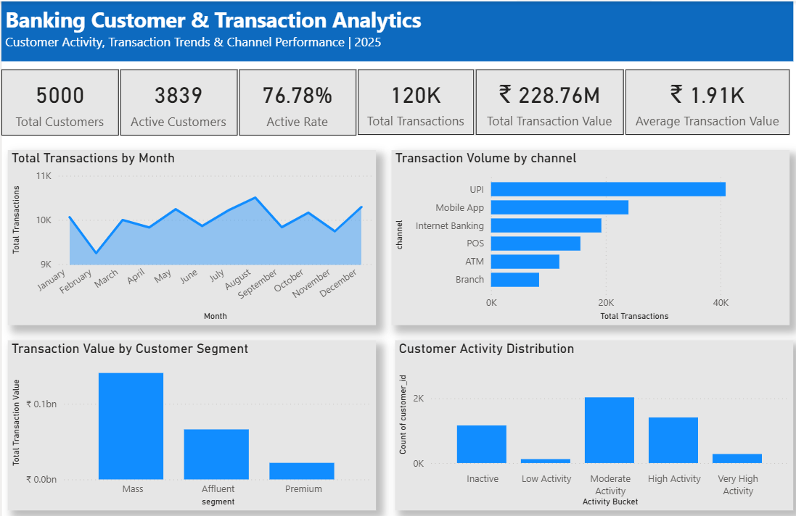

# Banking Customer & Transaction Analytics

An end-to-end banking analytics project using **SQL, Python/pandas, and Power BI** to analyze customer activity, transaction trends, transaction channels, and customer segments.

This project demonstrates how raw banking data can be transformed into **business insights and decision-ready reporting**.

---

### Dashboard Preview




## 📌 Project Overview

Banks generate large volumes of customer and transaction data. Raw transaction records alone do not provide an easy way to understand customer engagement, transaction behavior, or channel usage.

This project analyzes a **synthetic banking dataset** to answer practical business questions:

- How many customers are actively using their accounts?
- What proportion of customers are inactive?
- Which customer segments generate the most transaction value?
- Which transaction channels have the highest usage?
- How does transaction activity change throughout the year?
- How frequently are active customers transacting?
- How different are transaction values across customer segments?
- Which customers show high transaction activity?

### Analytics Workflow

```text
Business Problem
       ↓
Data Validation
       ↓
SQL Analysis
       ↓
Python / pandas EDA
       ↓
Power BI Dashboard
       ↓
Business Insights
```

---

## 🎯 Business Objectives

The main objectives of this project are to:

1. Measure overall customer activity.
2. Analyze transaction volume and transaction value.
3. Understand customer activity levels.
4. Compare transaction behavior across customer segments.
5. Identify the most-used transaction channels.
6. Analyze monthly transaction trends.
7. Build an interactive Power BI dashboard.
8. Translate analytical findings into business-oriented insights.

---

## 📊 Dataset

This project uses a **synthetic banking dataset created for portfolio and demonstration purposes**.

| Dataset | Description | Records |
|---|---|---:|
| `customers.csv` | Customer demographic and segmentation information | 5,000 |
| `accounts.csv` | Customer account information and balances | 7,500 |
| `products.csv` | Banking product master data | 8 |
| `transactions.csv` | Account transactions during 2025 | 120,000 |
| `customer_products.csv` | Customer-to-product relationships | 8,261 |
| `data_dictionary.csv` | Field definitions and descriptions | 26 |

**Analysis period:** January 1, 2025 – December 31, 2025  
**Currency:** Indian Rupees (INR)

---

## 🗂️ Data Model

The project uses a relational data model connecting customers, accounts, transactions, and products.

```text
Customers
    |
    | 1 : Many
    v
Accounts
    |
    | 1 : Many
    v
Transactions


Customers
    |
    | 1 : Many
    v
Customer_Products
    ^
    |
    | Many : 1
Products
```

### Key Relationships

- `customers.customer_id` → `accounts.customer_id`
- `accounts.account_id` → `transactions.account_id`
- `customers.customer_id` → `customer_products.customer_id`
- `products.product_id` → `customer_products.product_id`

---

## 🛠️ Tools & Technologies

### SQL / PostgreSQL

Used for:

- Data validation
- Row-count checks
- Referential integrity checks
- Joins
- Aggregations
- Customer segmentation
- Transaction analysis
- Channel analysis
- Account analysis
- High-value transaction analysis

### Python / pandas

Used for:

- Data loading
- Data preparation
- Data merging
- Exploratory Data Analysis
- Customer-level analysis
- Activity segmentation
- Correlation analysis
- Supporting visualizations

### Power BI

Used for:

- KPI reporting
- Customer activity analysis
- Monthly transaction trends
- Channel performance
- Segment-level transaction value analysis
- Interactive business dashboard

---

## 📈 Key KPIs

The analysis produced the following headline metrics for 2025:

| KPI | Result |
|---|---:|
| Total Customers | 5,000 |
| Active Customers | 3,839 |
| Active Customer Rate | 76.78% |
| Inactive Customers | 1,161 |
| Total Transactions | 120,000 |
| Total Transaction Value | ₹228.76M |
| Average Transaction Value | ₹1,906.31 |

> **Active customer definition:** A customer with at least one recorded transaction during 2025.

---

## 💡 Key Business Insights

### 1. Customer Activity

3,839 out of 5,000 customers were active during 2025, resulting in an activity rate of **76.78%**.

A total of 1,161 customers had no recorded transaction activity during the year.

**Business implication:**  
The inactive customer population represents an area for further investigation and potential re-engagement analysis.

---

### 2. Activity is Concentrated in Moderate and High Activity Customers

Among active customers:

| Activity Level | Customers |
|---|---:|
| Low Activity | 122 |
| Moderate Activity | 2,030 |
| High Activity | 1,408 |
| Very High Activity | 279 |

Moderate and High Activity customers together represent approximately **89.56% of active customers**.

This indicates that customer activity is broadly distributed among regularly active customers rather than being concentrated only among a small group of very-high-frequency users.

---

### 3. UPI Has the Highest Transaction Volume

UPI recorded:

- **40,909 transactions**
- Approximately **34.1% of all transactions**
- Approximately **₹78.90M in transaction value**

It was followed by Mobile App and Internet Banking in transaction volume.

Average transaction values across channels were relatively close, ranging from approximately **₹1,867 to ₹1,929**.

This indicates that the major difference between channels in this dataset is transaction volume rather than transaction size.

---

### 4. Monthly Transaction Activity Remained Relatively Stable

Monthly transaction volume ranged from:

- **February:** 9,247 transactions
- **August:** 10,505 transactions

August recorded the highest monthly transaction volume, while February recorded the lowest.

The dataset does not show a strong sustained upward or downward trend throughout 2025.

---

### 5. Mass Segment Generated the Largest Transaction Value

| Segment | Customers | Transaction Value | Value Share |
|---|---:|---:|---:|
| Mass | 3,071 | ₹140.72M | 61.5% |
| Affluent | 1,442 | ₹66.15M | 28.9% |
| Premium | 487 | ₹21.88M | 9.6% |

The Mass segment generated the largest absolute transaction value, broadly consistent with its larger customer population.

Average transaction values were relatively similar:

| Segment | Average Transaction Value |
|---|---:|
| Affluent | ₹1,913.57 |
| Mass | ₹1,909.56 |
| Premium | ₹1,864.51 |

This indicates that transaction value in this dataset is influenced more by customer population and transaction frequency than by large differences in average transaction size between segments.

---

## 🔎 Customer Value Analysis

Customer-level analysis was performed to understand the relationship between transaction frequency and total transaction value.

The analysis found a strong positive correlation:

**Correlation coefficient (r) = 0.914**

Customers with more transactions generally contributed more total transaction value.

However, transaction frequency alone does not fully explain customer value because average transaction size varies between customers.

---

## 📊 Power BI Dashboard

The Power BI dashboard provides an executive-level view of:

- Total Customers
- Active Customers
- Active Rate
- Total Transactions
- Total Transaction Value
- Average Transaction Value
- Monthly Transaction Trends
- Transaction Volume by Channel
- Transaction Value by Customer Segment
- Customer Activity Distribution

### Dashboard Preview


---

## 🧮 SQL Analysis

The SQL analysis includes queries for:

- Overall KPI calculations
- Customer segmentation
- Customer activity
- City analysis
- Age-group analysis
- Transaction trends
- Debit vs. credit transactions
- Transaction channel analysis
- Account-type analysis
- High-value transactions
- Customer-level transaction activity
- Product adoption

SQL scripts are available in:

[`sql/banking_analysis.sql`](sql/banking_analysis.sql)

---

## 🐍 Python Analysis

Python/pandas was used to perform:

- Data loading
- Data type conversion
- Table merging
- Customer-level transaction analysis
- Segment-level analysis
- Activity bucket creation
- Transaction value analysis
- Channel analysis
- Correlation analysis
- Exploratory visualizations

The notebook is available in:

[`python/banking_eda.ipynb`](python/banking_eda.ipynb)

---

## 📝 Business Insights Documentation

Detailed findings, limitations, and recommended future analyses are documented in:

[`documentation/business_insights.md`](documentation/business_insights.md)

---

## 📁 Project Structure

```text
banking-customer-transaction-analytics/
│
├── README.md
│
├── data/
│   ├── customers.csv
│   ├── accounts.csv
│   ├── products.csv
│   ├── transactions.csv
│   ├── customer_products.csv
│   └── data_dictionary.csv
│
├── sql/
│   └── banking_analysis.sql
│
├── python/
│   └── banking_eda.ipynb
│
├── powerbi/
│   └── banking_customer_transaction_analytics.pbix
│
├── screenshots/
│   └── dashboard_overview.png
│
└── documentation/
    └── business_insights.md
```

---

## ✅ Data Quality & Validation

Before performing analysis, the dataset was validated using SQL.

### Row Count Validation

| Table | Records |
|---|---:|
| Customers | 5,000 |
| Accounts | 7,500 |
| Products | 8 |
| Transactions | 120,000 |
| Customer-Product Relationships | 8,261 |

### Referential Integrity

The analysis confirmed:

- No orphan accounts were found.
- No orphan transactions were found.
- Customer, account, transaction, and product relationships were validated before analysis.

### Transaction Validation

Transaction values were checked for:

- Minimum and maximum values
- Average transaction value
- Total transaction value
- Transaction type totals
- Date range

Debit and credit transaction totals reconcile to the overall transaction count and transaction value.

---

## ⚠️ Important Analytical Limitation

The `transactions` table does **not** contain a `product_id`.

Although customers can be associated with multiple banking products through `customer_products`, it would not be reliable to directly assign transaction values to products.

Therefore:

- Product analysis focuses on **customer product adoption and activity**.
- Transaction value is **not attributed to individual products**.

This avoids double-counting and incorrect product-level value attribution.

---

## ⚠️ Other Limitations

This is a synthetic portfolio dataset and does not represent the actual performance of a real financial institution.

The dataset does not contain:

- Customer profitability
- Transaction fees
- Customer acquisition cost
- Fraud labels
- Campaign information
- Customer satisfaction
- Churn indicators
- Product-level transaction identifiers
- Customer lifetime value

High-value transactions should therefore **not** automatically be interpreted as fraudulent or suspicious.

---

## 🚀 Recommended Future Analysis

If additional business data were available, this project could be extended with:

- Customer churn and retention analysis
- Customer lifetime value
- Customer profitability
- Product cross-sell analysis
- Channel migration analysis
- Cohort analysis
- Fraud/anomaly detection using labeled outcomes
- Customer segmentation using behavioral features
- Campaign effectiveness analysis

---

## 🧠 Skills Demonstrated

### SQL

- Joins
- Aggregations
- CTEs
- CASE statements
- Window functions
- Data validation
- Business analysis

### Python

- pandas
- NumPy
- Data cleaning
- Data transformation
- Exploratory Data Analysis
- GroupBy analysis
- Correlation analysis
- Data visualization

### Power BI

- Data modeling
- Relationships
- DAX measures
- KPI cards
- Interactive dashboards
- Business reporting

### Analytics

- Customer segmentation
- Customer activity analysis
- Transaction analysis
- Channel analysis
- Trend analysis
- Business insight generation

---

## 🎯 Project Outcome

This project demonstrates an end-to-end analytics workflow from raw transactional data to business reporting:

```text
Raw Banking Data
       ↓
Data Validation
       ↓
SQL Analysis
       ↓
Python / pandas EDA
       ↓
Customer & Transaction Insights
       ↓
Power BI Dashboard
       ↓
Business Reporting
```

The objective is not only to calculate metrics, but to demonstrate how a Data Analyst can translate raw data into **clear, business-oriented insights and decision-ready reporting**.

---

## 👤 Author

**Data Analyst Portfolio Project**

### Target Roles

- Data Analyst
- Technical Data Analyst
- SQL Analyst
- Business Data Analyst
- Reporting Analyst

### Core Tools

**SQL · Python · pandas · Power BI · Excel · Data Visualization**
